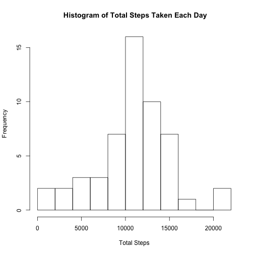
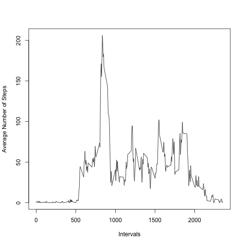
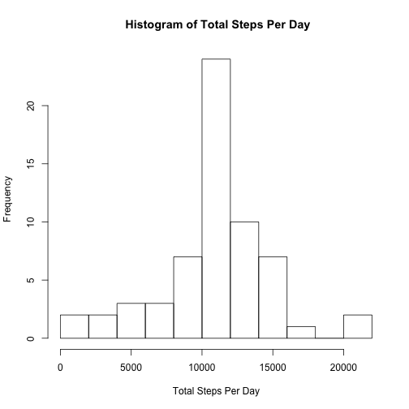
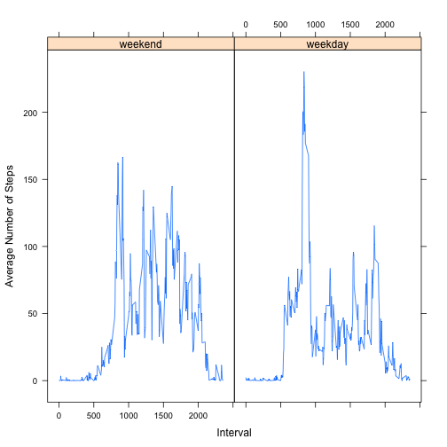

### What is mean total number of steps taken per day?

(1) Calculate the total number of steps taken per day

```r
library(plyr)
library(dplyr)
Data2 <- na.omit(Data)
Data2 <- ddply(Data2,"date", summarize, steps = sum(steps))
```

(2) Make a histogram of the total number of steps taken each day

```r
hist(Data2$steps, breaks = 10, main = " Histogram of Total Steps Taken Each Day", xlab = "Total Steps")
```

 

(3) Calculate and report the mean and median of the total number of steps taken per day

```r
mean(Data2$steps)
```

```
## [1] 10766.19
```

```r
#10766.19
median(Data2$steps)
```

```
## [1] 10765
```

```r
#10765
```

*Mean = 10766.19*

*Median = 10765*

### What is the average daily activity pattern?
(1) Make a time series plot (i.e. 𝚝𝚢𝚙𝚎 = "𝚕") of the 5-minute interval (x-axis) and the average number of steps taken, averaged across all days (y-axis)

```r
Data3 <- na.omit(Data)
Data3 <- ddply(Data3, "interval",summarise, steps = mean(steps))
plot(Data3$interval, Data3$steps, type = "l", xlab = "Intervals", ylab = "Average Number of Steps")
```

 

(2) Which 5-minute interval, on average across all the days in the dataset, contains the maximum number of steps?


```r
Data3$interval[which.max(Data3$steps)] 
```

```
## [1] 835
```

*835 is the 5-minute interval that contains the maximum number of steps on average across all days*

### Imputing missing values

(1) Calculate and report the total number of missing values in the dataset (i.e. the total number of rows with 𝙽𝙰s

```r
dim(Data) - dim(na.omit(Data)) 
```

```
## [1] 2304    0
```

*There are 2304 rows with NAs*

(2) Devise a strategy for filling in all of the missing values in the dataset. The strategy does not need to be sophisticated. For example, you could use the mean/median for that day, or the mean for that 5-minute interval, etc.


```r
Data4 <- Data
for (i in 1:NROW(Data4$steps)) {
  if (is.na(Data4$steps[i]) == TRUE){
    x <- match(Data4$interval[i], Data3$interval)
    Data4$steps[i] <- Data3$steps[x]
  }
}
```

(3) Create a new dataset that is equal to the original dataset but with the missing data filled in.


```r
NewData <- Data4
```

(4) Make a histogram of the total number of steps taken each day and Calculate and report the mean and median total number of steps taken per day. Do these values differ from the estimates from the first part of the assignment? What is the impact of imputing missing data on the estimates of the total daily number of steps?


```r
NewData2 <- ddply(NewData,"date", summarize, steps = sum(steps))
hist(NewData2$steps, breaks = 10, main = " Histogram of Total Steps Per Day", xlab = "Total Steps Per Day")
```

 

```r
mean(NewData2$steps)
```

```
## [1] 10766.19
```

```r
median(NewData2$steps)
```

```
## [1] 10766.19
```

*The mean (10766.19) is the same, but the median (10766.19) is lightly larger than the estimate from the first part of the assignment. Imputing missing data with the means of 5-min intervals seems to have barely impacted the estimates of the total daily number of steps*

###Are there differences in activity patterns between weekdays and weekends?

(1) Create a new factor variable in the dataset with two levels – “weekday” and “weekend” indicating whether a given date is a weekday or weekend day.


```r
NewData3 <- NewData
NewData3$date <- as.Date(NewData3$date)
DaysofWeek <- c('Monday', 'Tuesday', 'Wednesday', 'Thursday', 'Friday')
NewData3$TypeofDay <- factor((weekdays(NewData3$date) %in% DaysofWeek),levels=c(FALSE, TRUE), labels=c('weekend', 'weekday')) 
```

(2) Make a panel plot containing a time series plot (i.e. 𝚝𝚢𝚙𝚎 = "𝚕") of the 5-minute interval (x-axis) and the average number of steps taken, averaged across all weekday days or weekend days (y-axis). See the README file in the GitHub repository to see an example of what this plot should look like using simulated data.


```r
NewData4 <- ddply(NewData3, c("interval", "TypeofDay"), summarise, steps = mean(steps))
library(lattice)
xyplot(steps ~ interval | TypeofDay, data = NewData4, type ="l", xlab = "Interval", ylab = "Average Number of Steps")
```

 

*Yes, there are differences in activity patterns between weekdays and weekends. Although the most average number of steps are taken around the 900th 5-min interval during both the weekend and weekdays, the number of steps taken during that interval on the weekday is about 100 steps greater than on the weekend.*


